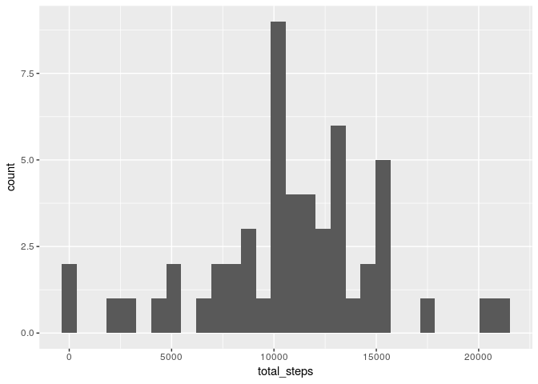

# Reproducible Research: Peer Assessment 1

## Loading and preprocessing the data

Here we make a tibble from the data:


```r
library(tidyverse)
df_columns = cols(
  steps = col_integer(),
  date = col_date(format = ""),
  interval = col_integer()
)
df <- read_csv("activity.csv", col_types = df_columns)
```

## What is mean total number of steps taken per day?

The number of steps per day can be found by grouping by day and summing:

```r
steps_by_day <- df %>% group_by(date) %>% summarise(total_steps = sum(steps))
```


```r
ggplot(data = steps_by_day) + geom_histogram(mapping = aes(x=total_steps), bins=30)
```

<!-- -->

The mean and median daily steps can be calculated from the same frame:

```r
mean_daily_steps <- mean(steps_by_day$total_steps, na.rm = TRUE)
median_daily_steps <- median(steps_by_day$total_steps, na.rm = TRUE)
```
The mean number of steps is 1.0766189\times 10^{4} and the median is 10765. 

## What is the average daily activity pattern?

We can group the steps in the original frame by interval and find the mean across every day (ignoring NA values):

```r
interval_steps <- df %>% group_by(interval) %>% summarise(mean_steps = mean(steps, na.rm = TRUE))
```


```r
ggplot(interval_steps) + geom_line(mapping = aes(x=interval, y=mean_steps)) + ylab("mean steps per interval")
```

<!-- -->


```r
interval_with_most_steps <- interval_steps$interval[which.max(interval_steps$mean_steps)]
```
The interval that has the most steps (on average) is 835.

## Imputing missing values

The total number of NA rows in the set can be found from

```r
NA_rows <- sum(is.na(df$steps))
NA_rows
```

```
## [1] 2304
```
The following replaces intervals that have NA with the mean value for that interval across the rest of the sample rounded to an integer:

```r
df_mod <- df %>% group_by(interval) %>% mutate(steps = ifelse(is.na(steps), round(mean(steps, na.rm = TRUE)), steps))
```

The total steps per day in this modified frame can be found as before (grouping by date and summing):

```r
steps_by_day_mod <- df_mod %>% group_by(date) %>% summarise(total_steps = sum(steps))
```
The histogram of the data with missing values replaced by averages is below:

```r
ggplot(steps_by_day_mod) + geom_histogram(mapping = aes(x=total_steps), bins=30)
```

<!-- -->


```r
mean_daily_steps_mod <- mean(steps_by_day_mod$total_steps)
median_daily_steps_mod <- median(steps_by_day_mod$total_steps) 
```
The difference between the mean before and after imputing missing variables is

```r
mean_daily_steps - mean_daily_steps_mod
```

```
## [1] 0.549335
```
Similarly, the difference in the median is

```r
median_daily_steps - median_daily_steps_mod
```

```
## [1] 3
```
Both measures of the central tendency have decreased through imputing the missing variables. 


## Are there differences in activity patterns between weekdays and weekends?

The following adds two columns to the modified frame

* day_of_week: is the day of the week for the datat
* when: is a factor that is either "weekday" or "weekend":


```r
df_mod$day_of_week = weekdays(df_mod$date, abbreviate = TRUE)
df_mod$when = factor("weekday", levels = c("weekday","weekend"))
df_mod$when[df_mod$day_of_week == "Sat" | df_mod$day_of_week == "Sun"] = "weekend"
```
With the new factor variable it is possible to group by interval and "when" ("weekday"/"weekend") and find the mean number of steps:

```r
interval_steps_mod <- df_mod %>% group_by(interval,when) %>% summarise(mean_steps = mean(steps))
```
The plot of the mean number of steps per interval brokwn down between weekend and weekdays is shown below. 

```r
ggplot(interval_steps_mod) + geom_line(mapping=aes(x=interval,y=mean_steps)) + facet_grid(when~.) + ylab("mean steps per interval")
```

<!-- -->


